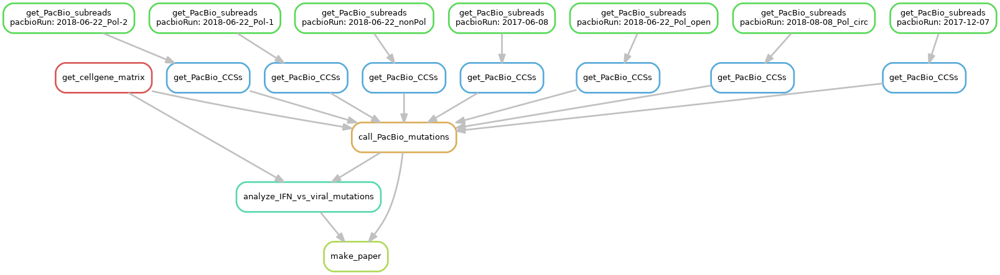

# Single-cell sequencing of IFN-sorted influenza-infected cells

## Authors
Alistair Russell and [Jesse Bloom](https://research.fhcrc.org/bloom/en.html).

## Overview
Analysis of single-cell mRNA sequencing of influenza-infected A549 cells that have been enriched for IFN+ cells.

A549 cells were infected with A/WSN/1933 influenza virus at a relatively low MOI.
These A549 cells contained a sortable marker (LNGFRdel) under an IFNbeta promoter.
At 13-hours post-infection, the cells were sorted to enrich for IFN+ ones. 
These enriched IFN+ cells were mixed with some of the ones that did not sort as IFN+, and they were sequenced on the [Chromium 10X platform](https://www.10xgenomics.com/single-cell/).

A modest number of non-infected MDCK (canine) cells were also included to enable assessment of mRNA leakage and lsysis.

The virus used was a mix of wildtype and virus with synonymous "barcodes" near the 3' end to help enable identification of co-infection, similar to the approach in [Russell et al (2018)][].
But whereas in that experiment that viral genomes were barcoded only at the end that gives the 3' end of the mRNA, in this experiment they were barcoded at both ends.

The viral mRNA in the IFN-enriched sample was then amplified by semi-specific PCR and sequenced using PacBio long-read technologies to obtain full length sequences for the viral genomes.

## Organization of analysis
The analysis is performed by a set of [Jupyter notebooks](http://jupyter.org/) that do the following.

The entire analysis can be run by executing the [Snakemake](https://snakemake.readthedocs.io/en/stable/) file [Snakefile](Snakefile) with:

        snakemake

To run this command on the Fred Hutch computing cluster across multiple nodes, execute the file [run_snakemake_Hutch_cluster.sbatch](run_snakemake_Hutch_cluster.sbatch) with:

    sbatch run_snakemake_Hutch_cluster.sbatch

Here is a visualization of the pipeline in [Snakefile](Snakefile) created in the file `workflow.png` with:

    snakemake --forceall --dag | dot -Tpng > workflow.png

This workflow involves the following major steps:

#### Get cell-gene matrix
The Python notebook [align_and_annotate.ipynb][] demultiplexes and aligns the reads, annotates the flu synonymous barcodes, and generates the cell-gene matrix. 
It requires installation of [cellranger](https://support.10xgenomics.com/single-cell-gene-expression/software/pipelines/latest/what-is-cell-ranger), which performs the demultiplexing and alignment. 
It also uses custom Python and bash scripts found in the `./scripts/` subdirectory, and requires installation of a few common Python modules. 
The notebook describes the software versions used. 
The end result of this notebook is an annotated cell-gene matrix that is stored in `./results/cellgenecounts/`. 
There are separate matrices for the human cells with flu reads (*humanplusflu*) and the canine reads (*canine*):

    results/cellgenecounts/merged_canine_cells.tsv
    results/cellgenecounts/merged_canine_genes.tsv
    results/cellgenecounts/merged_canine_matrix.mtx
    results/cellgenecounts/merged_humanplusflu_cells.tsv
    results/cellgenecounts/merged_humanplusflu_genes.tsv
    results/cellgenecounts/merged_humanplusflu_matrix.mtx

#### Get PacBio circular consensus sequences (CCSs)
[Snakefile](Snakefile) runs the PacBio [ccs](https://github.com/PacificBiosciences/unanimity/blob/develop/doc/PBCCS.md) program to build circular consensus sequences.
These are placed in the directory `./results/pacbio/ccs/`.

#### Call viral mutations from PacBio CCSs 
The Python notebook [pacbio_analysis.ipynb][] analyzes the PacBio CCSs to identify mutations present in viruses infecting individual cells. 
Numerous plots and a detailed analysis are included in this notebook.
In addition, the notebook creates an annotated version of the cell descriptor for the cell-gene matrix that contains information about the mutations that can be called by the PacBio sequencing. 
This is the created file:

    results/cellgenecounts/PacBio_annotated_merged_humanplusflu_cells.tsv

#### Analyze viral features associated with IFN induction.
The R notebook [monocle_analysis.ipynb][] analyzes the cell-gene matrix to look for viral features associated with IFN induction.
The analysis makes substantial use of the [Monocle][] package, and the results are described within the notebook.

## Input data
The `./data/` subdirectory contains input data used by the analysis:

1. The file [./data/PacBio_runs.tsv](./data/PacBio_runs.tsv) contains a list of the PacBio runs and the locations of their corresponding subreads files on the Hutch computing cluster.

2. The subdirectory [./data/flu_sequences/](./data/flu_sequences) contains the influenza genomes for both the wildtype A/WSN/1933 virus and the variants with double synonymous barcodes. See the [README](./data/flu_sequences/README.md) in that directory for more details.

3. The subdirectory [./data/images/](./data/images/) contains some schematic images used in the Jupyter notebooks.

## Results and Conclusions
The results from the analysis in each notebook are displayed and described in that notebook.

All output from the analyses are written to the `./results/` subdirectory.

[align_and_annotate.ipynb]: align_and_annotate.ipynb
[monocle_analysis.ipynb]: monocle_analysis.ipynb
[pacbio_analysis.ipynb]: pacbio_analysis.ipynb
[Monocle]: http://cole-trapnell-lab.github.io/monocle-release/
[Russell et al (2018)]: https://doi.org/10.7554/eLife.32303
